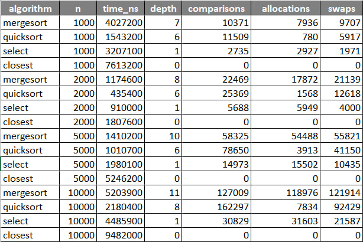

#  Divide and Conquer Algorithms

##  Overview
This repo is a project where I implemented some classic **divide-and-conquer algorithms** in Java.

The main goals were:
- Practice recursion (and avoid stack overflow)
- Compare running times and recursion depth
- Collect metrics (time, comparisons, allocations)
- See how theory (Master Theorem / Akra–Bazzi) matches real runs

---

##  Algorithms Implemented
1. **MergeSort** – stable `O(n log n)` sorting with one buffer
2. **QuickSort** – randomized pivot, tail recursion optimization
3. **Deterministic Select** – median-of-medians, guaranteed `O(n)`
4. **Closest Pair of Points** – geometric algorithm in `O(n log n)`

---

##  Implementation Notes

### Recursion Control
- QuickSort recurses only on the smaller side (avoids deep stacks)
- Depth tracking via ThreadLocal counter
- Insertion sort cutoff for arrays `< 10`

### Memory Control
- MergeSort reuses a single buffer
- Select allocates only ~`n/5` medians
- Metrics tracker logs allocations

```java
// QuickSort tail recursion trick
if (leftSize < rightSize) {
    quickSort(arr, left, pivot - 1);
    left = pivot + 1; // loop on bigger side
} else {
    quickSort(arr, pivot + 1, right);
    right = pivot - 1;
}
```
##  Recurrence Analysis

- **MergeSort:**  
  `T(n) = 2T(n/2) + Θ(n)` → **Θ(n log n)**

- **QuickSort (average case):**  
  `T(n) = T(n/4) + T(3n/4) + Θ(n)` → **Θ(n log n)**

- **QuickSort (worst case):**  
  **Θ(n²)** (avoided with random pivot)

- **Deterministic Select:**  
  `T(n) ≤ T(n/5) + T(7n/10) + Θ(n)` → **Θ(n)**

- **Closest Pair of Points:**  
  `T(n) = 2T(n/2) + Θ(n)` → **Θ(n log n)**

---

##  How to Run

```bash
# build project
mvn clean compile

# run tests
mvn test

# run an algorithm manually
mvn exec:java -Dexec.mainClass="com.algorithms.cli.AlgorithmRunner" \
              -Dexec.args="quicksort 100000"
```
---

##  Testing

- Unit tests with **JUnit5**
- Stress tests with **random arrays**
- Edge cases covered:
    - Empty arrays
    - Sorted arrays
    - Duplicate values
- **Closest Pair** tested on:
    - Collinear points
    - Duplicate points

---

##  Results (Short)

- **MergeSort:** stable, reliable, but slightly slower constants
- **QuickSort:** fastest in practice on random inputs
- **Select:** slower constants, but guaranteed **linear time**
- **Closest Pair:** scales as expected with **Θ(n log n)**

---

##  Conclusion

Divide-and-conquer is **super versatile**:

- **MergeSort** → stable & consistent
- **QuickSort** → fastest on average
- **Select** → theoretical safety net
- **Closest Pair** → recursion applied to geometry  

